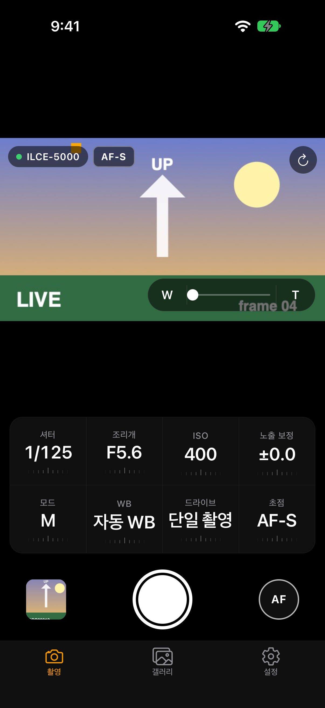
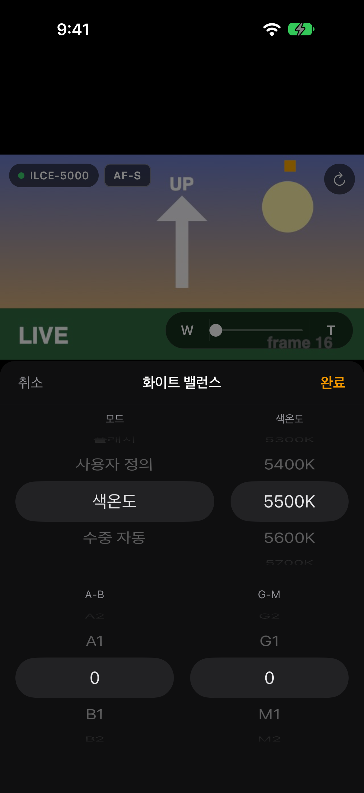
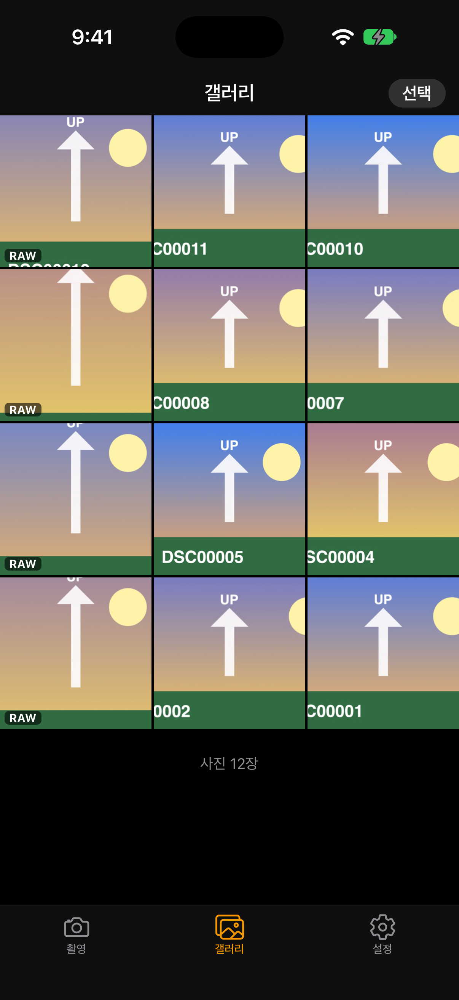
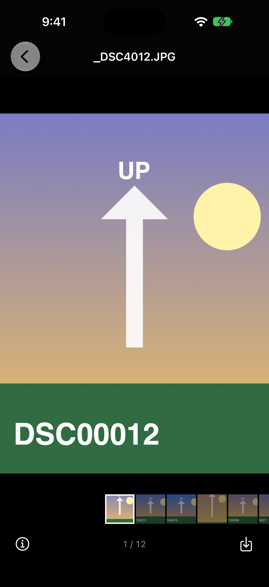
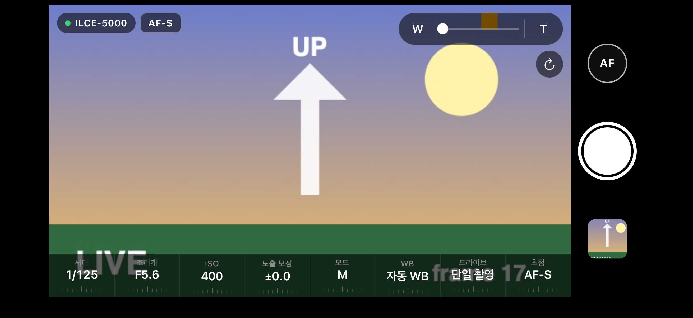
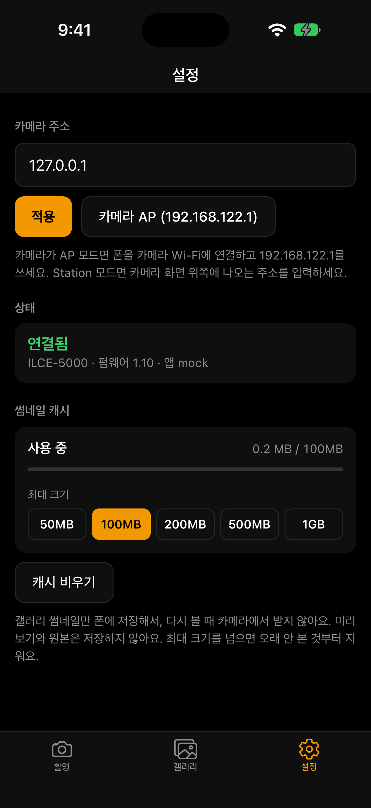
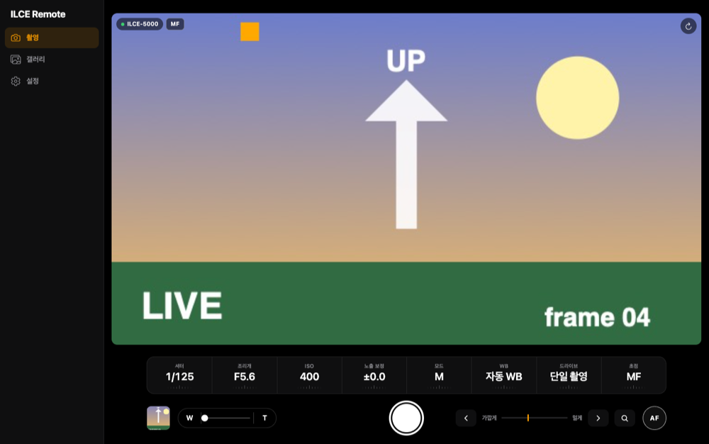

# sony-remote-reboot

Sony α5000 (ILCE-5000)을 폰·태블릿·PC에서 원격으로 조작하는 앱. 카메라 안에서 도는 앱이 라이브뷰와 촬영
제어, 사진을 HTTP로 내주고, 폰 앱이나 브라우저에서 그걸 씁니다.

카메라 기본 원격 기능보다 더 많은 설정(셔터·조리개·ISO·WB·초점 등)과 갤러리를 폰에서 다루려고 만들었습니다.
비공식 프로젝트이며 Sony와 관련이 없습니다.

<p>




</p>
<p>


</p>


## 할 수 있는 것

- **라이브뷰**: 카메라가 하드웨어로 인코딩한 JPEG 프레임을 그대로 MJPEG으로 스트리밍 (AP 모드 지연 ~0.3초).
  카메라를 세로로 들면 라이브뷰도 세로로 돌아갑니다.
- **촬영**: 셔터, 누르고 있는 동안 반셔터(AF), 파워줌(버튼·위치 슬라이더), MF 초점 이동과 초점 확대.
- **설정**: 촬영 모드, 셔터속도, 조리개, ISO, 노출 보정, 화이트 밸런스(색온도·A-B·G-M), 드라이브, 초점 모드.
  설정 칸을 좌우로 끌어 바로 바꾸거나, 눌러서 iOS 피커 같은 휠로 고릅니다. 마지막 설정은 앱을 다시 켜도 복원.
- **갤러리**: 카메라 카드의 사진을 격자로 보고, 사진 앱처럼 넘기며 보기·확대, EXIF 정보, 여러 장 선택(끌어서 선택)해
  원본 JPEG 또는 RAW(ARW) 받기. 썸네일은 기기에 캐시(최대 크기 설정 가능).
- **세 가지 클라이언트**
  - 폰 앱 (`viewer/`, Expo/React Native): 사진 앱에 바로 저장.
  - 웹앱 (`camera/web/`): 카메라가 직접 제공하는 PWA. 설치 없이 브라우저에서 `http://<카메라 IP>:8080/`,
    iOS는 홈 화면에 추가하면 앱처럼 실행. 폰에서는 폰 앱과 같은 화면이고, 태블릿·PC에서는 사이드바와 큰 라이브뷰,
    키보드 단축키(Space 촬영, F 반셔터, W/T 줌)와 마우스 휠 조작을 씁니다.
  - HTTP API: 아래 표 참고. 스크립트에서 바로 써도 됩니다.

## 구조

```
camera/       카메라에 설치하는 Android 앱 (OpenMemories, Android 2.3.7 / API 10)
camera/web/   카메라가 제공하는 웹앱 소스 (빌드 때 minify·gzip 되어 APK에 들어감)
viewer/       폰 앱 (Expo SDK 57) 과 카메라 없이 개발하는 mock 서버
```

카메라가 Wi-Fi AP(`192.168.122.1`)가 되어 폰이 직접 붙거나, 카메라를 집 Wi-Fi에 붙여(Station 모드) 같은
네트워크에서 씁니다. 카메라 화면 위쪽에 주소가 표시됩니다.

## 시작하기

1. 카메라에 앱 설치: 아래 [설치](#설치) (USB, [Sony-PMCA-RE](https://github.com/ma1co/Sony-PMCA-RE) 사용).
2. 카메라 메뉴 → 애플리케이션 → ILCE Remote 실행.
3. 폰을 카메라 Wi-Fi에 연결하고
   - 브라우저로 `http://192.168.122.1:8080/` 를 열거나,
   - 폰 앱 설정 탭에서 카메라 주소를 넣습니다.

실기기 확인: ILCE-5000, 펌웨어 1.10, PMCA API 3, Android 2.3.7. 다른 기종은 확인하지 않았습니다.

> 카메라에 비공식 앱을 설치하는 것은 본인 책임입니다. 이 앱은 펌웨어를 고치지 않고 OpenMemories 앱으로만 동작합니다.

## camera — 개발 환경

| 항목 | 버전 |
|---|---|
| JDK | 17+ (21에서 확인) |
| Gradle | 8.11.1 (wrapper) |
| AGP | 8.7.3 |
| compileSdk / build-tools | 35 / 35.0.0 |
| minSdk / targetSdk | 10 / 10 |
| OpenMemories-Framework | `f8df350` (JitPack) |
| NanoHTTPD | 2.3.1 |

Android SDK 는 `~/Library/Android/sdk` (cmdline-tools 로 `platforms;android-35`, `build-tools;35.0.0`, `platform-tools` 설치).

### 빌드

```sh
cd camera
./gradlew assembleDebug
# → app/build/outputs/apk/debug/ilce-remote-debug-<ver>.apk
```

빌드 후 `checkDebugApiLevel` 이 자동으로 돌아서, 번들된 라이브러리까지 포함해 API 10 보다 새로운
프레임워크 API 를 쓰는 곳이 있으면 실패합니다 (`tools/check-api-level.py`). 우리 코드는 lint `NewApi` 가 잡습니다.

Java 8 **문법**(람다 등)은 D8 이 desugar 해주지만, Java 8 **라이브러리**(`java.util.function`,
`java.nio.file`, `StandardCharsets` 등)는 카메라에 없으니 쓰면 안 됩니다.

### 설치

1. 카메라 메뉴 → USB 연결 → `MTP` (또는 대용량 저장장치)
2. USB 로 Mac 에 연결
3. `camera/tools/install.sh` (pmca-console 이 없으면 자동 다운로드; x86_64 바이너리라 Rosetta 필요).
   macOS 에서는 libusb 가 카메라를 커널/`ptpcamerad` 로부터 떼어내려면 root 가 필요해서 `sudo` 로 실행됩니다
   (sudo 없이 돌리면 `USBError: [Errno 13] Access denied`)
4. 카메라 메뉴 → 애플리케이션 → ILCE Remote

연결만 테스트하려면: `sudo camera/tools/pmca-console info`

### Wi-Fi 개발 루프 (adb)

카메라를 Station 모드로 집 Wi-Fi 에 붙이고, Tweak 에서 ADB 를 켠 뒤 ILCE Remote(디버그 빌드)를 띄워둔 상태에서:

```sh
CAMERA_IP=172.16.1.151 camera/tools/dev-install.sh
```

빌드 → `/api/debug/exit` 로 앱을 정상 종료(Wi-Fi 유지) → `adb install -r` → 카메라에서 앱 실행 대기 → logcat.

- 실행 중인 앱을 `adb install -r` 로 바로 덮으면 강제 종료되는데, 이때 카메라 UI 가 멈춘 적이 있어서 먼저 정상 종료시킵니다.
- Sony 런처가 셸(`am start`)에서의 앱 실행을 막으므로 실행은 카메라에서 직접 해야 합니다.
- 로그는 `adb logcat -s ILCERemote` 또는 SD 카드의 `ILCEREMO/LOG.TXT`.

### 디버깅

[OpenMemories: Tweak](https://github.com/ma1co/OpenMemories-Tweak) 을 설치하면 카메라에서 adb 를 켤 수 있습니다
(`sudo camera/tools/pmca-console install -a com.github.ma1co.openmemories.tweak`). 켠 뒤 카메라와 같은 네트워크에서 `adb connect <카메라 IP>`.

## viewer — 폰 앱 (Expo SDK 57)

촬영(라이브뷰, 셔터/반셔터, 줌, 휠로 설정 변경, AF/MF), 갤러리(사진 방향 처리, 원본 저장), 설정(카메라 주소, 썸네일 캐시) 탭.
폰을 가로로 돌리면 라이브뷰를 크게, 카메라를 세로로 들면 라이브뷰를 세로로 돌려 보여준다.

```sh
cd viewer
npm install
swift mock/generate-samples.swift      # 목 서버용 합성 샘플 이미지 (최초 1회)
npm run mock                           # 카메라 없이 개발: 카메라 API 흉내 (port 8080)
EXPO_PUBLIC_CAMERA_HOST=127.0.0.1 npx expo start   # 시뮬레이터 + 목 서버
```

실제 카메라로 개발할 때는 `EXPO_PUBLIC_CAMERA_HOST` 를 카메라의 Station 모드 주소로. 앱에서 주소를 바꾸면 저장되고,
기본값은 AP 모드 주소 `192.168.122.1`. 폰이 카메라 AP 에 붙으면 Mac 의 개발 서버에 못 닿으므로 개발은 Station 모드로 한다.

## 웹앱 (PWA, camera가 직접 제공)

카메라에서 ILCE Remote를 켜고 같은 Wi-Fi(또는 카메라 AP)에서 브라우저로 `http://<카메라 IP>:8080/` 을 열면 폰 앱과 같은 촬영 화면(라이브뷰, 설정, 셔터/반셔터, 줌 슬라이더, MF 초점 확대)과 갤러리(선택·드래그 선택·원본 받기, 좌우로 넘기는 사진 보기)와 설정(썸네일 캐시 크기)을 쓸 수 있다. 갤러리 썸네일은 IndexedDB 에 캐시된다.

- 소스는 `camera/web/` (번들러 없는 순수 JS). 카메라 앱 빌드 때 Gradle `buildWeb` 태스크가 HTML/CSS/JS 를 minify 하고 `.gzip` 사본을 만들어 `app/build/generated/webAssets/web/` 에 넣는다(카메라는 gzip 을 받는 브라우저에 그 사본을 보낸다, 약 194KB → 111KB). 처음 한 번 `cd camera/web && npm install` 이 필요하고, Gradle 이 node 를 못 찾으면 `camera/local.properties` 에 `node.path=` 를 적는다. 앱 버전이 ETag.
- 태블릿·PC(화면 짧은 변 600px 이상): 왼쪽 사이드바, 촬영 화면은 가로면 라이브뷰 오른쪽에 설정 다이얼·초점·줌·셔터 열(세로 태블릿은 폰처럼 아래), 휠 시트는 가운데 대화상자, 설정은 가운데 정렬. 키보드: Space 촬영, F 누르는 동안 반셔터, W/T 줌, 1–3 탭 전환, 사진 보기에서 ←/→·I(정보)·Esc, 시트에서 Enter/Esc. 마우스 휠을 설정 칸 위에서 굴리면 값이 바뀐다.

- iOS Safari: 공유 → "홈 화면에 추가" 하면 전체 화면 앱으로 실행된다.
- 카메라는 `http://` 라서 Service Worker·Web Share 는 쓸 수 없다(보안 컨텍스트 전용). 원본은 파일로 받아지며, 사진 앱에 넣으려면 사진 보기에서 두 번 탭해 원본을 연 뒤 길게 눌러 저장한다. Android Chrome 은 바로가기로만 추가된다.
- 개발: `cd viewer && npm run mock` 의 mock 서버도 `/` 에서 `camera/web/` 소스를 그대로 제공한다. 빌드 결과를 확인하려면 `MOCK_WEB=<빌드 폴더> npm run mock`.

## HTTP API (camera, port 8080)

| 경로 | 내용 |
|---|---|
| `GET /api/info` | 모델/펌웨어/앱 버전 JSON |
| `GET /api/camera` | 촬영 설정: `mode`(program/aperture/shutter/manual/auto/other), `iso`+`isoValues`(0=AUTO), `shutter`[n,d]+`shutterText`, `aperture`, `ev`/`evMin`/`evMax`/`evStep`, `whiteBalance`(+Values), `driveMode`(+Values), `focusMode` |
| `POST /api/camera` | JSON 으로 변경 후 새 상태 반환: `mode`, `iso`, `ev`, `whiteBalance`, `driveMode`, `shutter`("1/250"), `shutterStep`(+빠르게), `aperture`(5.6), `apertureStep`(+조임) |
| `POST /api/camera/shutter` | 원격 촬영 `{status: ok\|canceled\|error\|timeout, ms}` |
| `POST /api/camera/focus` | 반셔터 `{action: start\|stop}` → `{focused}` (start 는 AF 가 끝날 때 응답) |
| `POST /api/camera/focusdrive` | MF 초점 이동 `{direction: near\|far, speed}` (렌즈 지원 시, `focusDriveSupported`) |
| `POST /api/camera/zoom` | 파워줌 `{direction: tele\|wide\|stop, speed}`, 또는 위치로 `{target: 0..1}` (카메라가 감속하며 멈춤, 상태는 `zoom`) |
| `POST /api/camera/magnify` | 초점 확대 `{action: cycle\|off\|center\|pan, dx, dy}` (pan은 확대 화면 기준 비율), 상태는 `magnifier` |
| `GET /api/camera/params` | Camera.Parameters 원본 (탐색용) |
| `GET /api/photos?offset=&limit=` | 최신순 사진 목록 `{total, offset, items:[{id, folder, file, date(ms), jpeg, raw}]}` |
| `GET /api/photos/{id}` | 상세: 파일명/폴더/`width`/`height`/`orientation`(EXIF)/ISO/조리개/셔터/초점거리 |
| `GET /api/photos/{id}/thumb` | EXIF 썸네일 160x120 (~6KB). 항상 4:3, 다른 비율은 검은 띠 포함 |
| `GET /api/photos/{id}/small` | 긴 변 ~480px (~20-30KB), **회전 적용됨**, SD `ILCEREMO/THUMB/` 캐시 — 갤러리 격자용 |
| `GET /api/photos/{id}/preview` | JPEG 내장 MPF 미리보기 (예: 1920x1080), 회전 미적용 |
| `GET /api/photos/{id}/full` | 원본 JPEG (~4MB), 회전 미적용 |
| `GET /api/photos/{id}/raw` | 원본 ARW (~20MB) |
| `GET /api/liveview` | 라이브뷰 MJPEG (`multipart/x-mixed-replace`), 640x360 |
| `GET /api/liveview.jpg` | 최신 라이브뷰 프레임 1장 |
| `GET /api/debug/*` | 디버그 빌드 전용: `exit`, `stats`, `liveview?w=&h=&rate=&interval=`, `blob?size=` |

라이브뷰는 `CameraSequence` 프리뷰 프레임을 쓴다. 프레임(`DeviceBuffer`)이 카메라 하드웨어에서 이미 JPEG 으로
인코딩돼 나오므로 CPU 인코딩 없이 그대로 전송한다. (표준 `Camera.setPreviewCallback` 은 이 기종에서 프레임이 오지 않음.)

촬영 제어 메모 (ILCE-5000 fw 1.10 실측):
- 앱이 떠 있는 동안 direct shutter 를 켜 둬서 물리 셔터(반셔터 AF 포함)가 평소처럼 동작한다.
- direct shutter 가 켜져 있으면 앱의 촬영 명령(`burstableTakePicture`, `Camera.takePicture`)은 즉시 canceled →
  원격 촬영은 direct shutter 를 잠깐 끄고 찍은 뒤 다시 켠다 (~150ms).
- 셔터속도/조리개는 한 단계씩만 바뀌고, 변경 콜백 전에 보낸 단계는 무시된다. 콜백 시점에 `getParameters()` 는 아직
  이전 값이라 응답 전에 값이 따라잡기를 기다린다.
- M 모드에서 EV 보정은 (ISO AUTO 가 아니면) 카메라가 무시한다.

사진 비율은 16:9/3:2/4:3/1:1 모두 가능하고 세로 사진도 있으므로 뷰어는 비율을 가정하지 않는다.
`small` 외의 이미지는 상세의 `orientation`(1/3/6/8) 을 보고 뷰어가 회전해서 보여줘야 한다.
AP 모드 실측: preview ~0.6s, full(4MB) ~2.6s.

네트워크 메모: 집 공유기(Station) 환경에서는 2.4GHz 혼잡으로 큰 패킷 손실이 커서 스트림이 끊길 수 있음.
AP 모드(폰 직결)에서는 부드럽고 지연 ~0.3s.

## 참고 / 감사

- [Sony-PMCA-RE](https://github.com/ma1co/Sony-PMCA-RE) — 설치 도구
- [OpenMemories-Framework](https://github.com/ma1co/OpenMemories-Framework) — `com.sony.scalar.*` 스텁 + 래퍼
- [PMCADemo](https://github.com/ma1co/PMCADemo) — 예제 (`WifiDirectActivity`: 카메라 AP 모드)
